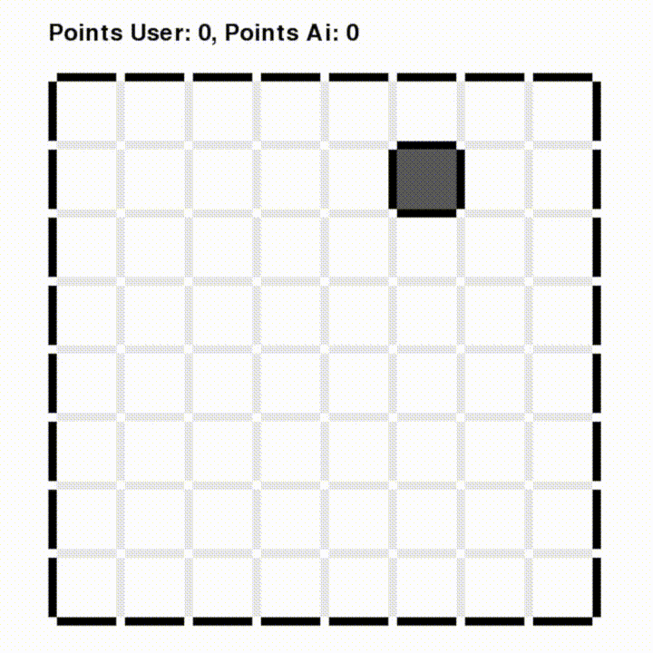
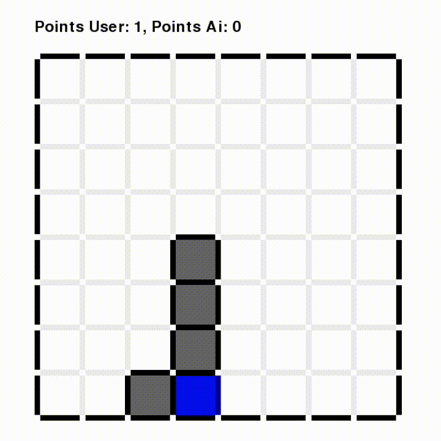
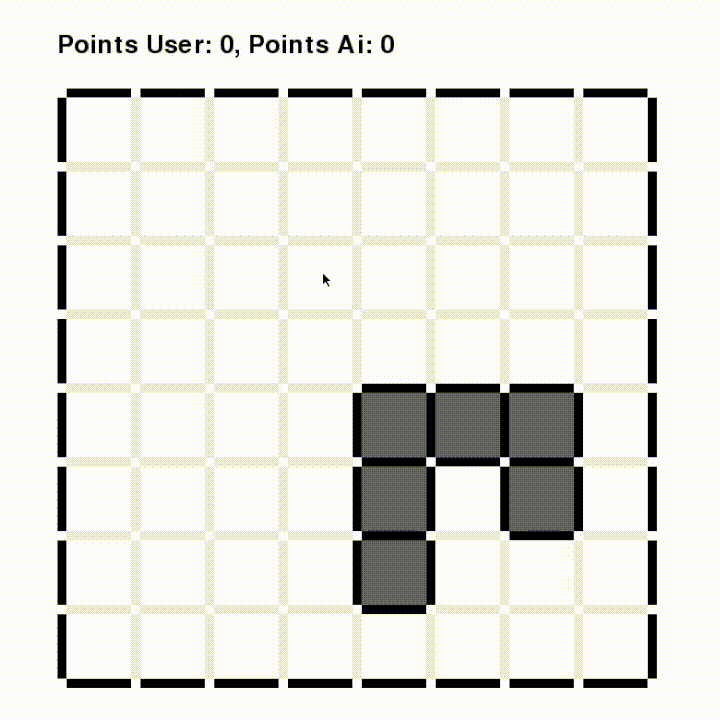

## What have we done:
We took a first shot in implementing a reinforcement learning algorithm (Q-Learning) to train a neural network capable of playing Dots and Boxes. We were inspired by the successes of DeepMind.

## What is dots and boxes:
Starting with an empty grid of dots, two players take turns adding a single horizontal or vertical line between two unjoined adjacent dots. The player who completes the fourth side of a 1×1 box earns one point and takes another turn. The game ends when no more lines can be placed. The winner is the player with the most points. (https://en.wikipedia.org/wiki/Dots_and_Boxes)

## Basic network architecture:
Our network is a feedforward neural network consisting of three fully connected layers(with Relu as activation function) and one output layer, also fully connected, representing all positions on the game field (144 positions in our case).
Layer sizes are as follows:
1. 1728
2. 3456
3. 1728

## Training process:
After trying different hyperparameters we ended up using adadelta as optimizer with an initial learning rate of 1.0 and mse as loss function. As discount factor for Q-Learning we chose 0.5. The training time for the final model was four months.

In the beginning we trained one model, which was playing against itself, ending up in a very deterministic gameplay. Meaning it could only handle certain very specific situations.

We decided to create a second model and implemented a teacher-learner architecture. The models were playing against each other and only the learner was updating its network. Once the learner had a win rate of %90 in the last 100 games they would switch the roles. This allowed them to develop different strategies.

## Results:
Here you can see two games, we played against the fully trained model. (Player: blue, AI: green)

We have come to two realisations: 
- First the AI gets considerably better after the very beginnings of the game. We have two theories to explain this. The more time goes on the amount of possible moves reduces, what makes the decision easier. Also mistakes in the beginning hurt less.
- Second towards the end one good or bad move decides the game. So even if you generally make good decisions one bad one can make you lose, what makes rewarding and training more difficult. You can see this in the second video.

## Possible improvements:
Using fully connected layers means we had an immense amount of weights to train. Furthermore it is likely that it overfitted to situations it had seen before. More generalization, less weights and a shorter training time can be achieved with different architectures, such as CNNs.

Concerning the very long training time:
The game logic is completely implemented in python and each as we use reinforcement learning training needs the whole game to be virtually played. Implementing the game in C++, more efficient python implementation of the game(maybe numpy) or parallelization would improve this. Also the use of GPU could have speed it up.

## Usage:
To install requirements call pip3 install -r requirements.txt 

To train a model call python3 gameAiPlayAlwaysValidAivsAI.py(takes a lot of time) 

To play against the model, make sure the gui.py is referencing your model(changes need to be made in code), and then call python3 Gui.py 
